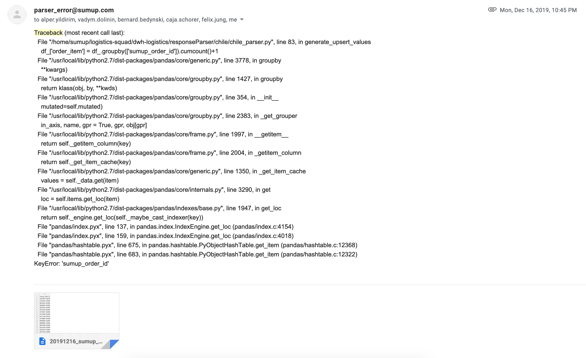
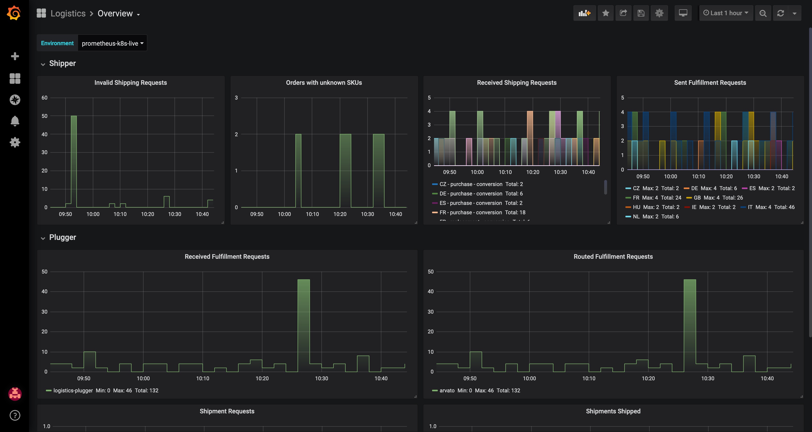
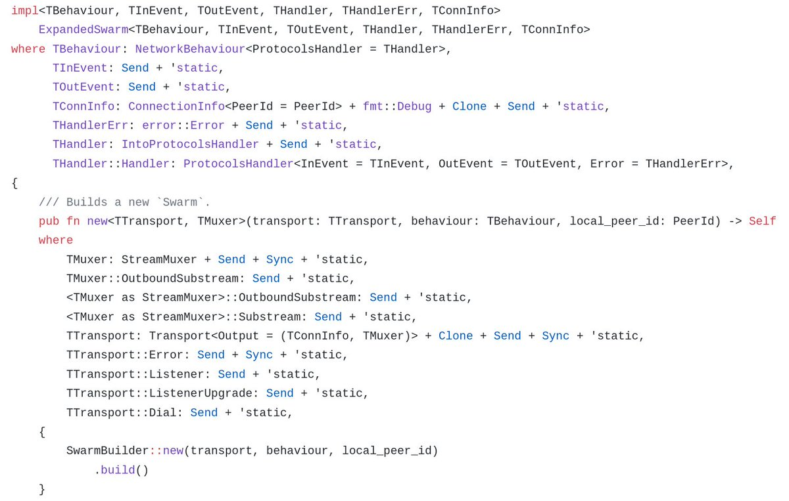

% Debugging Go Programs
% Tom Arrell
% Thursday 28th May – Golang Meetup – SumUp

---

# About me

## Tom Arrell 

- Senior Backend Engineer @ SumUp
- Logistics Squad
- twitter:  twitter.com/tom_arrell
- github:   github.com/tomarrell

---

# Agenda

:::incremental
- Go at SumUp
- Go in Logistics
- Why we're moving to Go
- Debugging...
  - Primitive
  - GDB
  - Delve
  - Scenarios...
:::

---

# Go at SumUp

- Adopted within the last 2 years
- Mainly used for tooling
- First services written ~1 year ago
- Now migrating to Go for new services
- Deployed to Kube

---

# Go in Logistics

- Joined around ~6 months ago
- Legacy Python scripts
  - Lack of monitoring
  - Email alerts
  - Git clone deployment
- Replaced with Go services
  - Deployed to Kubernetes
  - Prometheus, Sentry, OpsGenie
- 2 engineers with no prior Go experience brought up to speed

---

# Go in Logistics



---

# Go in Logistics

{ width=350px }

---

# Go in Logistics



---

# Leaky Abstractions

> All non-trivial abstractions, to some degree, are leaky.
> 
> – **Joel Spolsky**

---

# Leaky Abstractions

{ width=350px }

---

# Ruby to Go


---

# Now what you came for... Debugging.

We'll take a look at a few contrived scenarios, and how we might be able to get
some more insight with as little (or as much) effort as possible.

---

# Words of Wisdom

> If you dive into the bug, you tend to fix the local issue in the code, but if
> you think about the bug first, how the bug came to be, you often find and
> correct a higher-level problem in the code that will improve the design and
> prevent further bugs.
>
> – **Rob Pike**

--- 

# fmt.Println()

> fmt.Println() is the most universal, and all powerful debugger. Fight me.
>
> – **Me, circ. now**

---

# fmt.Println()

```go
package main

import "fmt"

func main() {
  fmt.Println("HERE")
  go func() {
    fmt.Println("Why are you not running?!")
  }()
  fmt.Println("HERE 2")
}
```

---

# GNU Debugger

- Ok if you're using CGO
- Not so ok if you're writing plain Go
    - Defer statements
    - The scheduler, context switching
    - Custom type defs of builtin types
    - Some identifiers

---

# Delve 

- Dedicated debugger for Go programs
- Supports debugging:
  - Running processes
  - Examining core dumps
  - Built from scratch programs
  - Tests
  - Tracing

---

# Scenario #1: Race Conditions

> ...ignoring this prohibition [of data races] introduces a practical risk of
> future miscompilation of the program.
> 
> – **Hans-J. Boehm**

---

# Scenario #1: Race Conditions

> No race is a safe race.
>
> – **Me, just now**

---

# Scenario #1: Race Conditions

Build your program with the `-race` flag. 

Good idea to run your tests with this flag enabled.

**Warning**: The race detector is not infallible, and it may possibly miss
certains cases. However, it will never report false positives.

Also.

```bash
$ go test -race mypkg   // check for races during tests
$ go build -race mycmd  // build a binary with R.D.
$ go run -race mysrc.go // immediate run with R.D.
```

---

# Scenario #2: Deferred functions

Are you getting values back from your function that you don't expect?

Do you want to know which defer statements are being called?

### Note:

The Go objdump tool displays the x86 assembly in **AT&T** syntax, whereas
Delve displays it in **Intel** syntax.

### Terms:

- **SP**: Stack pointer: top of stack.

---

# Scenario #3: Post-mortem

Sometimes our application has already crashed and we'd like to get a better idea
about the root cause.

One possible tool in our investigative toolbox are core dumps.

### Setup:
```bash
ulimit -c unlimited # Remove core dump size limit
```

### Terms:

- **Core dump**: A memory snapshot of a process, usually after a crash.

---

# Scenario #4: Memory Leaks

Slightly more nuanced, may only become a problem over time.

- Prometheus client, exposes heap information
  - Use for heap size monitoring over time
- pprof
  - Use for heap inspection of running process to find problem objs

Heap profiling with `pprof`.

```bash
go tool pprof localhost:8080/debug/pprof/heap
> web
> top
```

---

# Scenario #5: Goroutine Deadlocks

Very hard to debug.

pprof **blocking** profile not useful for deadlocked routines, but useful for
finding contentious resources in your program.

pprof lets you inspect the state of each goroutine in your program.

To get source annotated view of all goroutines in package `pkg`.

```bash
go tool pprof localhost:8080/debug/pprof/goroutine
> list [pkg]
```

Alternatively, you can look at the **full goroutine stack dump** using:
```
curl localhost:8080/debug/pprof/goroutine?debug=2
```

---

# Delve Tips

* Debug your test binaries as well
* `runtime.Breakpoint()`
* Checkpoints let you restart the program from a specific point
  * *Linux only*

---

> "Use the right tool for the job."
>
> – **Someone**, *I'm pretty sure*

--

*fin*

**Questions?**
